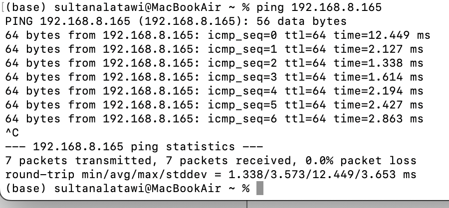
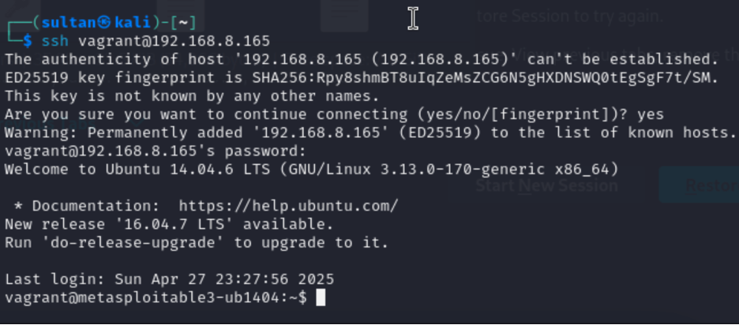
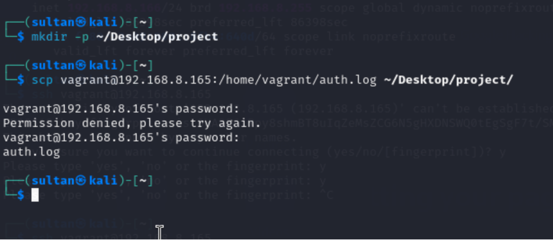
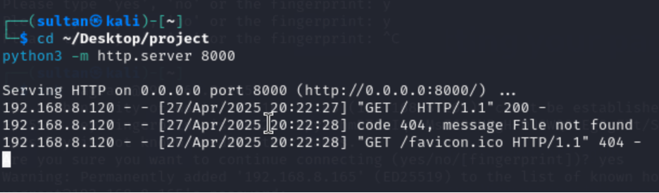
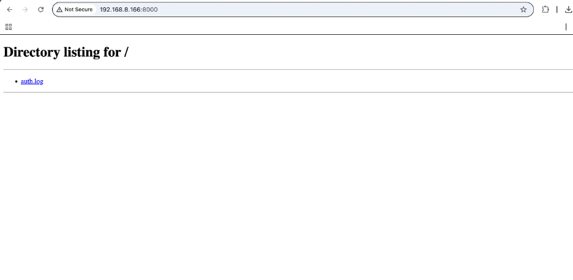
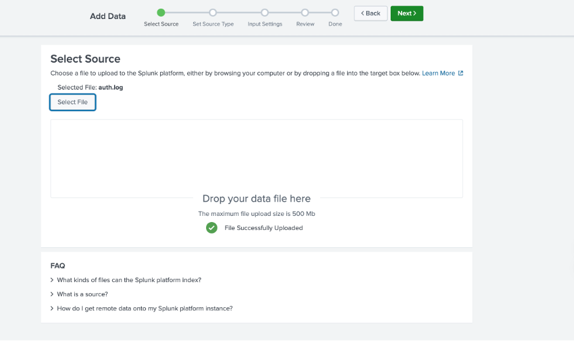
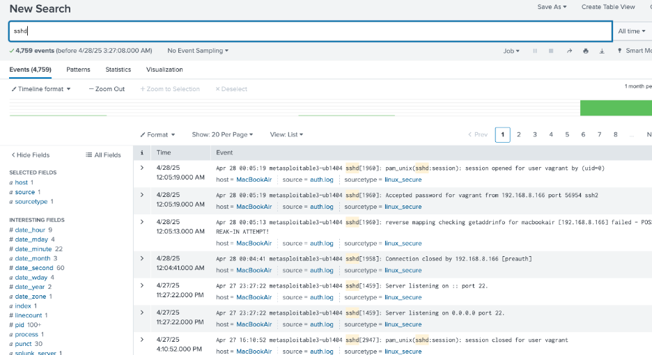
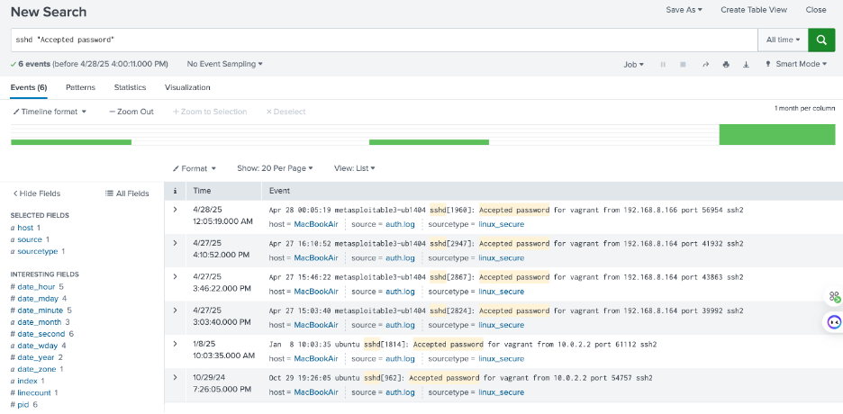

# Phase 2: SIEM Dashboard Analysis

---

## Introduction

In this phase, we implemented a Security Information and Event Management (SIEM) system using Splunk Enterprise to collect, analyze, and visualize SSH attack logs.  
The goal was to monitor and detect cyberattack patterns between an attacker (Kali Linux) and a victim (Metasploitable3) machine by analyzing authentication activities.

---

## Step 1: Environment Setup

| Machine | Role | Purpose | IP |
|:--------|:-----|:--------|:--------|
| Kali Linux (VMware) | Attacker | Launched brute-force and scripted SSH attacks | 192.168.8.166 |
| Metasploitable3 (UTM) | Victim | Hosted vulnerable SSH service | 192.168.8.165 |
| MacBook Pro (Host) | SIEM Server | Hosted Splunk Enterprise for log monitoring | 192.168.8.120 |


- **Splunk Version:** 9.4.1
- **Network Mode:** Bridge Network (for direct IP connectivity)
- **📸 Screenshot:** Successful ping from Host (Mac) to Victim Machine (Metasploitable3) — proving direct network communication.
  

---

## Step 2: Splunk Installation

- Downloaded and installed Splunk Enterprise on Mac via `.dmg` package.
- Configured admin username and password.
- Started Splunk server locally.

---

## Step 3: Attack Simulation (From Phase 1)

- SSH brute-force attacks were performed from Kali VM.
- Exploited SSH service on Metasploitable3.
- Validated successful and failed login attempts to generate logs.

---

## Step 4: Log Extraction from Victim Machine

**1. SSH login into Victim (Metasploitable3):**

```bash
ssh vagrant@192.168.8.165
```



---

**2. Copy auth.log to a readable directory:**

```bash
sudo cp /var/log/auth.log /home/vagrant/
sudo chmod 644 /home/vagrant/auth.log
```

---

**3. Copy log file to Attacker (Kali) using SCP:**

```bash
scp vagrant@192.168.8.165:/home/vagrant/auth.log .
```



---

**4. Verifying Splunk TCP Input:**
Before transferring the full log file, we validated that Splunk was ready to receive logs using a test logger message.

On the victim machine (Metasploitable3), we sent a message to the Splunk host using:


```bash
logger -n 192.168.8.120 -P 9997 "Test message from victim to Splunk"
```

- Screenshot: Sending test logger message from victim


This ensured that the TCP input at port 9997 was active and functioning correctly.

---
**5. Transfer auth.log from Attacker (Kali) to SIEM Host (Mac):**

To make the auth.log file available on the MacBook (SIEM Host), a simple HTTP server was started on Kali, and the file was downloaded via the browser:


```bash
cd ~/Desktop/project
python3 -m http.server 8000
```

- Screenshot: Hosting auth.log file on HTTP server



Access from Mac:

- Open the browser and navigate to: http://192.168.8.166:8000/


- Then click and download auth.log.
- Screenshot: Accessing auth.log from browser

  


## Step 5: Uploading Logs to Splunk

- Uploaded the `auth.log` file manually to Splunk through the Web GUI:
  - Settings → Add Data → Files & Directories → Upload.



---

## Step 6: Data Analysis in Splunk

### 1. Search for SSH authentication events

```bash
search: sshd
```



---

### 2. Identify Brute-Force Success Moments


After analyzing the uploaded SSH logs in Splunk, we searched specifically for successful brute-force attempts where the password was accepted.

```bash
sshd "Accepted password"
```




---

### 3. Pattern Analysis

Used the **Patterns** tab to identify repetitive authentication patterns.


---

### 4. Filter by Failed and Accepted Password Attempts

```bash
index=* sshd "Failed password" OR "Accepted password"
```


---

### 5. Attack Source Statistics (Optional Enhancement)

Extracted attacker IP addresses using regular expressions:

```bash
sshd "Failed password"
| rex "rhost=(?<attacker_ip>\d+.\d+.\d+.\d+)"
| stats count by attacker_ip
```


---

## Step 7: Comparison between Victim and Attacker Logs

- Victim machine provided rich authentication logs including successful and failed SSH login attempts.
- The analysis identified brute-force behavior clearly through SSH log patterns.
- Only one attacking IP was detected — confirming single-source brute-force attempt from the attacker's Kali machine.

---

## Conclusion

Through this phase, we successfully:

- Integrated victim-side SSH logs into Splunk.
- Visualized and analyzed brute-force attack patterns.
- Extracted login attempts, success/failure rates, and attacker IP statistics.
- Highlighted the power of SIEM platforms like Splunk in real-world cybersecurity incident detection.

The setup achieved full **log monitoring**, **pattern analysis**, and **threat visualization** as required.

---

# 📸 Notes:
- **Replace each `` path** with your real uploaded screenshot paths (match the names you saved).
- **Keep the order** to match your project flow for best grading.
