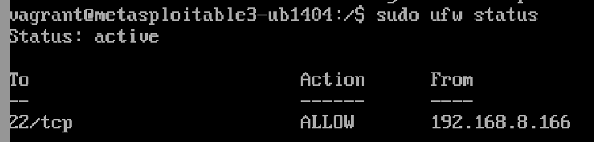

# Phase 3: Defensive Strategy Proposal

---

## 1. Introduction

In Phase 3 of the project, we implemented a defensive strategy to protect the SSH service on the Metasploitable3 victim machine. After successfully exploiting SSH vulnerabilities in Phase 1 and visualizing the attack patterns in Phase 2, the goal of this phase was to harden the system, restrict access, and prevent unauthorized or brute-force attempts.

---

## 2. Selected Defensive Mechanism

To secure the SSH service, we applied two critical layers of defense:

- **SSH Configuration Hardening:**
  - Disabled password-based authentication (`PasswordAuthentication no`) to block brute-force password attacks.
  - Disabled root login (`PermitRootLogin no`) to reduce the risk of privileged account compromise.

- **Network Firewall (UFW) Restriction:**
  - Allowed SSH access only from the Kali Linux attacker's IP address (`192.168.8.166`) for controlled testing.
  - Blocked all other incoming network connections by default (`ufw default deny incoming`).

- **Important Note:**
  - SSH access was temporarily limited to Kali's IP to allow controlled validation of defenses. In a real deployment, only trusted administrative IPs would be allowed.

This layered security ensured that even if someone reached the SSH port, they could not authenticate without proper credentials.

---

## 3. Implementation Steps

This section describes the step-by-step application of SSH hardening and firewall restrictions.

### 3.1 Harden SSH Configuration

- Opened the SSH server configuration file to modify default behavior:

  ```bash
  sudo nano /etc/ssh/sshd_config
  ```

- Applied critical security settings to minimize exposure:

  ```bash
  PermitRootLogin no
  PasswordAuthentication no
  ```


- Restarted the SSH service to apply and enforce the new secure configuration:

  ```bash
  sudo service ssh restart
  ```


---

### 3.2 Configure UFW Firewall

To restrict network-level access and limit SSH exposure:

- Updated the package repositories and installed UFW firewall if it was not already installed:

  ```bash
  sudo apt-get update
  sudo apt-get install ufw
  ```


- Configured UFW to allow only SSH access from the trusted attacker's IP address:

  ```bash
  sudo ufw allow from 192.168.8.166 to any port 22 proto tcp
  ```


- Applied default security rules to deny all incoming connections by default, then enabled the firewall:

  ```bash
  sudo ufw default deny incoming
  sudo ufw enable
  sudo ufw status
  ```


---

## 4. Testing and Validation

This section verifies that the implemented defenses successfully blocked previously successful attack methods.

### 4.1 SSH Login Attempt (Manual Test)

- Attempted manual SSH connection using previously valid credentials:

  ```bash
  ssh vagrant@192.168.8.165
  ```


- **Result:**  
  The connection failed with a **"Permission denied (publickey)"** error, confirming that password-based logins were disabled.

---

### 4.2 Brute-Force Attempt Using Hydra

- Attempted to re-run brute-force password attack using Hydra:

  ```bash
  hydra -l vagrant -P smalllist.txt ssh://192.168.8.165
  ```


- **Result:**  
  Hydra attack failed as the SSH service now requires public key authentication only, rejecting any password-based login attempts.

---

## 5. Before and After Comparison

### 5.1 Before Defense

Before applying security measures, the victim machine was fully vulnerable:

- SSH Access: Open to any device on the network
- Authentication: Password login permitted
- Firewall Protection: No firewall rules
- Attack Success: Successful brute-force and direct SSH login


---

### 5.2 After Defense

After hardening, the victim machine's exposure was drastically minimized:

- SSH Access: Restricted to the Kali attacker's IP address only
- Authentication: Password login disabled, key-based authentication required
- Firewall Protection: UFW enabled and enforcing network filtering
- Attack Success: All attack attempts failed

- SSH failure screenshot:


- Hydra attack failure screenshot:


- UFW firewall rules screenshot:


---

## 6. Conclusion

By applying SSH configuration hardening and implementing strict firewall rules, we significantly improved the security posture of the victim machine. Unauthorized access and brute-force attack attempts were successfully blocked. This demonstrates the effectiveness of defense-in-depth strategies, ensuring resilience against commonly exploited SSH vulnerabilities.

---
