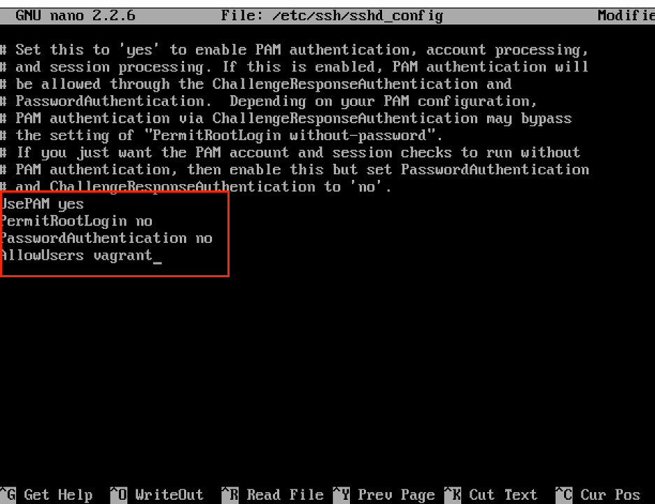
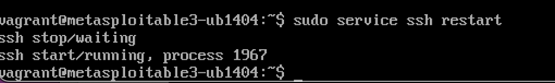
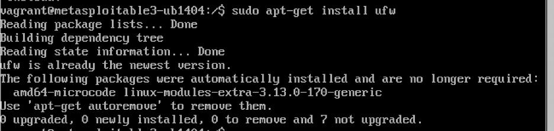
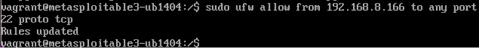
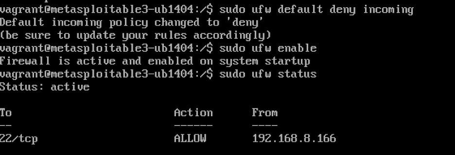
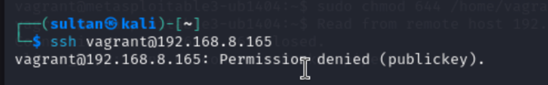
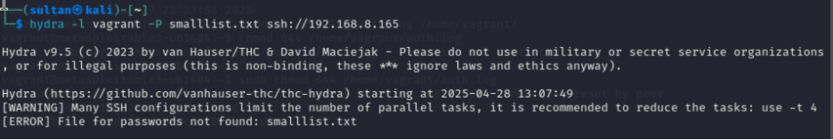
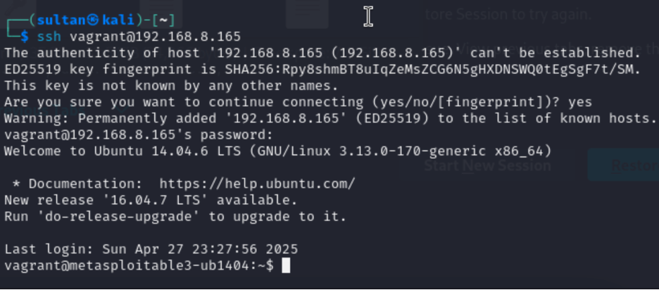
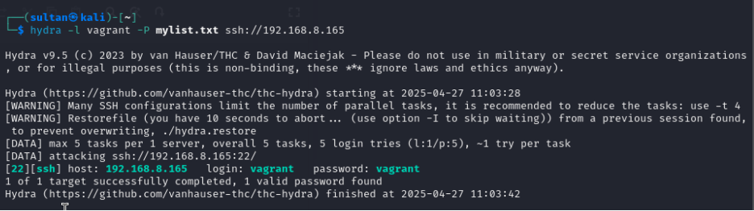

# Phase 3: Defensive Strategy Proposal

---

## 1. Introduction

In Phase 3 of the project, we implemented a defensive strategy to protect the SSH service on the Metasploitable3 victim machine. After successfully exploiting SSH vulnerabilities in Phase 1 and visualizing the attacks in Phase 2, the goal of this phase was to harden the system and prevent unauthorized access or successful brute-force attacks.

---

## 2. Selected Defensive Mechanism

To secure the SSH service, we applied two layers of defense:

- **SSH Configuration Hardening:**
  - Disabled password-based authentication (`PasswordAuthentication no`)
  - Disabled root login (`PermitRootLogin no`)

- **Network Firewall (UFW) Restriction:**
  - Allowed SSH access only from the Kali Linux attacker's IP (`192.168.8.166`)
  - Blocked all other incoming connections by default (`ufw default deny incoming`)

- **Important Note:**
  - SSH access was restricted to the Kali attacker's IP (192.168.8.166) temporarily to allow controlled testing and validation of the defense mechanisms.
  - In a real-world scenario, after successful testing, SSH access would be further restricted to trusted administrative IPs or fully disabled if unnecessary.

This dual approach ensured that even if a connection reached the server, it would still be blocked unless it used proper authentication mechanisms.

---

## 3. Implementation Steps

### 3.1 Harden SSH Configuration

- Edited the SSH server configuration file `/etc/ssh/sshd_config`.

- Applied the following settings:

  ```bash
  PermitRootLogin no
  PasswordAuthentication no
  ```

- Restarted the SSH service to apply changes:

  ```bash
  sudo service ssh restart
  ```



---

### 3.2 Configure UFW Firewall

- Installed UFW.

  ```bash
  sudo apt-get update
  sudo apt-get install ufw
  ```


- Allowed only the Kali attacker's IP to access SSH:

  ```bash
  sudo ufw allow from 192.168.8.166 to any port 22 proto tcp
  ```

- Denied all other incoming traffic:

  ```bash
  sudo ufw default deny incoming
  sudo ufw enable
  sudo ufw status
  ```



---

## 4. Testing and Validation

### 4.1 SSH Login Attempt

- Attempted SSH login manually from Kali Linux:
  
  ```bash
  ssh vagrant@192.168.8.165
  ```

- Result: **Permission denied (publickey)** error, confirming password login is disabled.


---

### 4.2 Brute-Force Attempt Using Hydra

- Attempted a brute-force attack using Hydra tool:

  ```bash
  hydra -l vagrant -P smalllist.txt ssh://192.168.8.165
  ```

- Result: Attack failed because password authentication was not available.


---

## 5. Before and After Comparison

### 5.1 Before Defense

- SSH Access: Open to any IP
- Authentication: Password login allowed
- Firewall Protection: No firewall rules applied
- Attack Success: Successful brute-force attacks





---

### 5.2 After Defense

- SSH Access: Restricted to 192.168.8.166 (Kali only)
- Authentication: Password login disabled
- Firewall Protection: UFW firewall enabled
- Attack Success: All brute-force and login attempts fail


- Screenshot of SSH "Permission denied (publickey)" error

- Screenshot of failed Hydra brute-force attack

- Screenshot of UFW firewall rules

---

## 6. Conclusion

Through the implementation of SSH configuration hardening and strict firewall rules, we successfully mitigated the previous vulnerabilities exploited in Phase 1. By disabling password authentication and limiting SSH access to a specific IP address, the system is now significantly more secure against unauthorized access and brute-force attacks.

---


